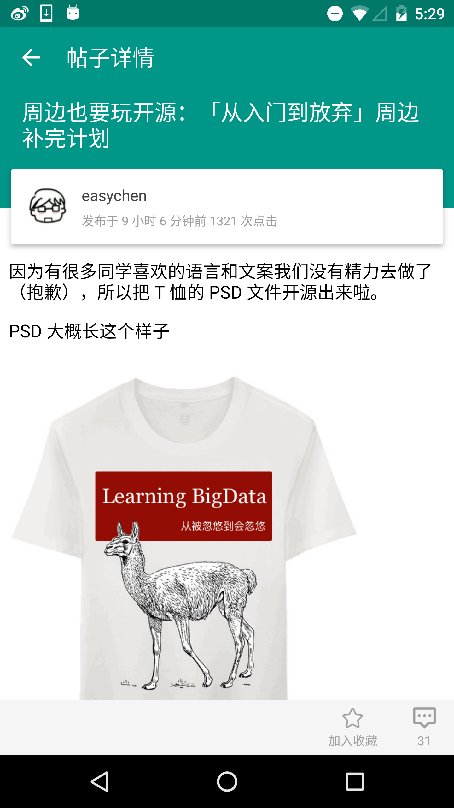

# OpenV2ex-android
v2ex第三方android客户端

> 最近在更新这个项目，post功能终于调通了^_^

功能
1. 主页tab话题列表
2. 数据库缓存
3. 节点列表
4. 节点话题列表
5. 话题内容
6. 个人详情
7. 已读状态刷新
 
使用的第三方库
[butterknife](https://github.com/JakeWharton/butterknife)
[roundedimageview](https://github.com/vinc3m1/RoundedImageView)
[retrofit](https://github.com/square/retrofit)
[okhttp](https://github.com/square/okhttp)
[jsoup](http://jsoup.org/)

